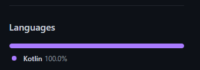
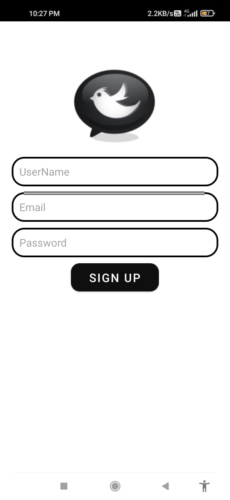
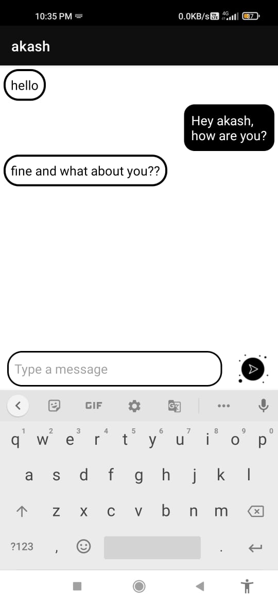

# Nuntius

### A Real time chatting android based smartphone application tailor made for allowing users to have personal chats with each other. Enabled firebase authentication for security and enabling login/signup feature.Integrated with Google Firebase for storing and retrieving messages later on through recyclerView using multi viewHolder.Engineered easy search feature for users and messages.Compatible with both potrait and landscape viewport orientation. 
 
 

## Programming Languages/Tech Stack used
---

 
 

## Tech Stack and Dependencies
---
### Kotlin
### XML
### Android Studio 
### Google Firebase
 
 

## Screenshots
---
### **Login Page**
#### This is the login page for the registered Nuntius user.
 

### **Signup Page**
#### This is the signup page for the new Nuntius user.
 

### **Chat Interface**
#### This is the chatting interface between two Nuntius users.
 

 
 

## Author
---
- [Sandeep Yadav](https://github.com/sandeep0614)
